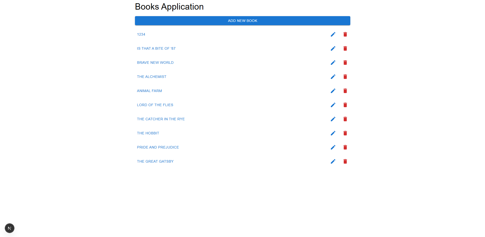
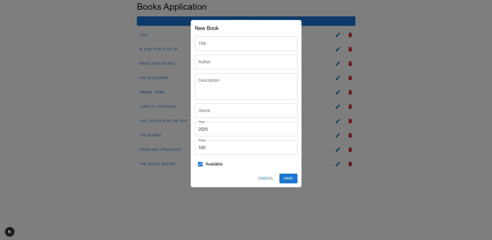
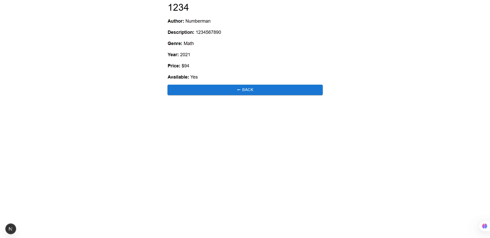
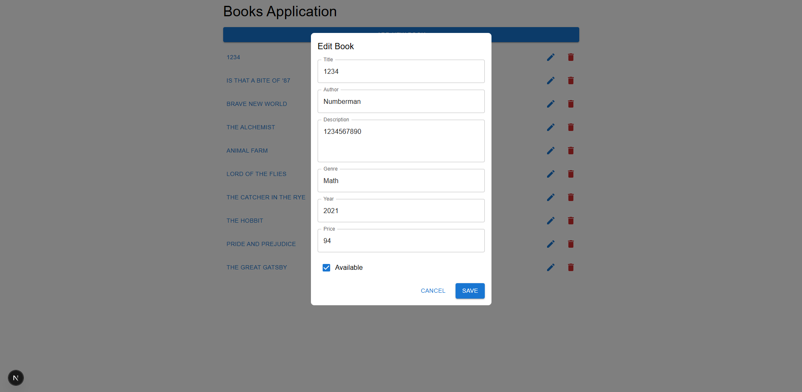
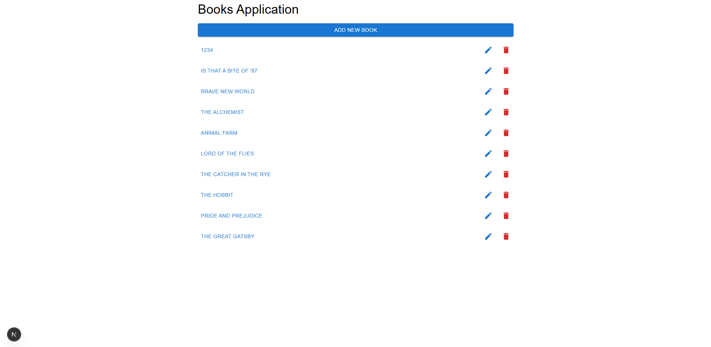
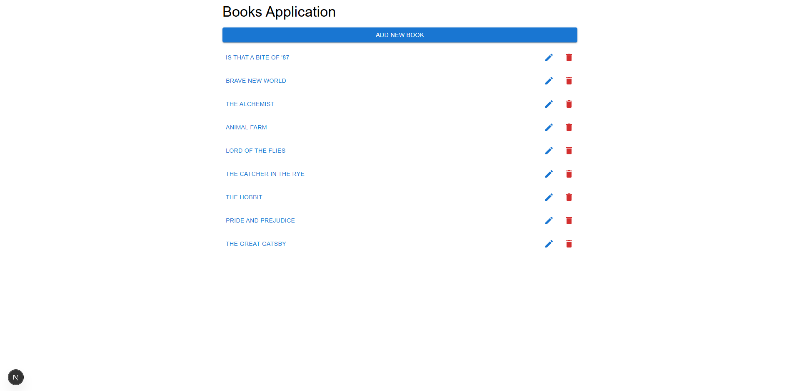
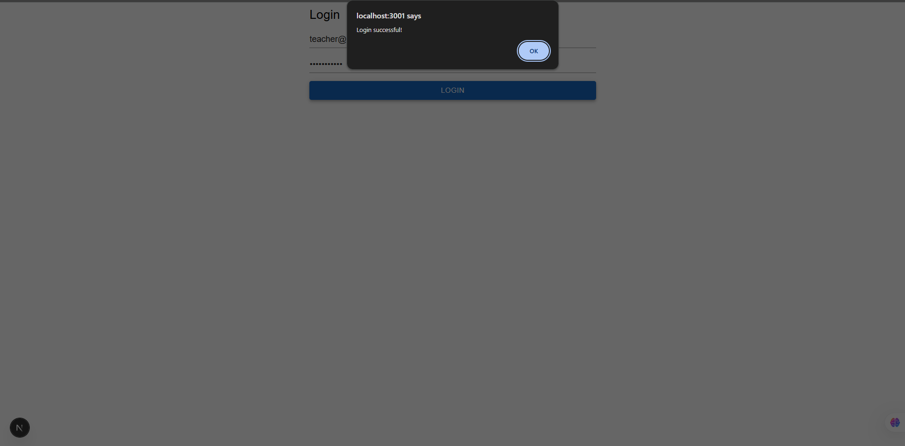
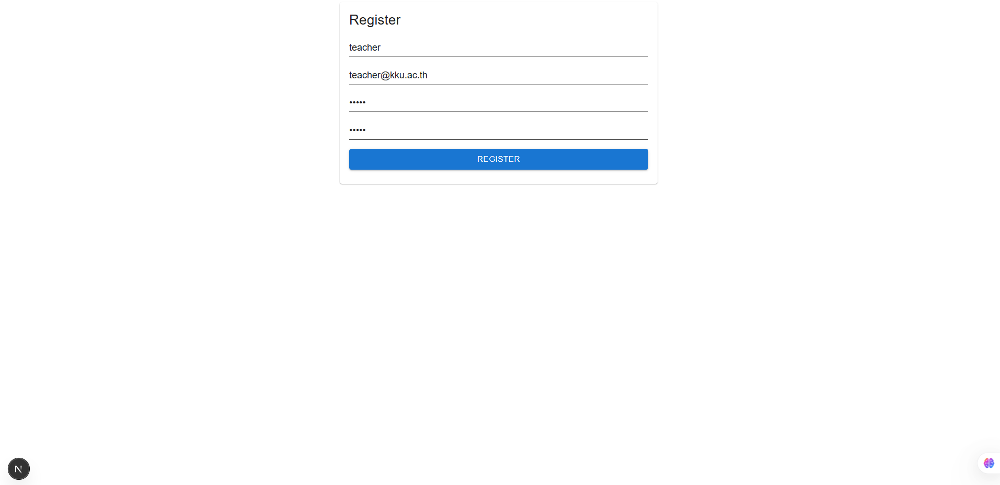
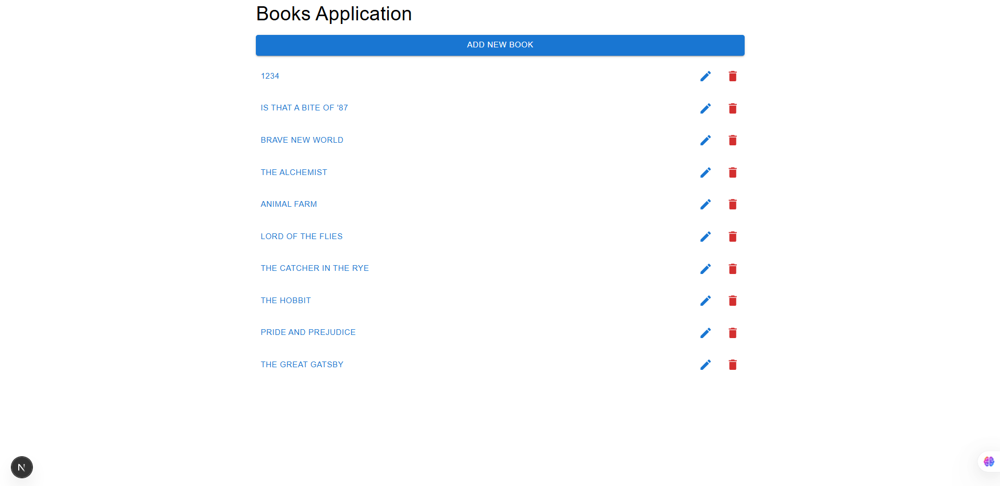
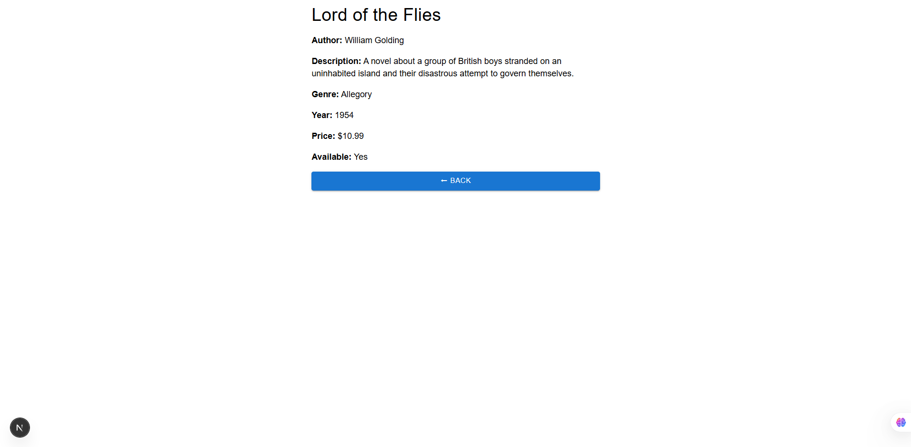

# book-app

# book-app

### API

http://localhost:3001/

### API Document

http://localhost:3000/api-docs

### Mongodb express -> ดูข้อมูลในฐานข้อมูล

http://localhost:8081/
-> username -> admin
-> password -> password123

```
{
  "username": "teacher",
  "email": "teacher@kku.ac.th",
  "password": "password123"
}
หน้าหลักโชว์หนังสือทั้งหมด


Create สามารถสร้างหนังสือใหม่ได้



Read สามารถเปิดดูข้อมูลหนังสือทั้งหมด และหนังสือรายเล่มได้


Update สามารถปรับปรุงข้อมูลหนังสือรายเล่มได้

Delete สามารถลบข้อมูลหนังสือรายเล่มได้
before:

after:

login/signin

Register


หลังจากloginมาแล้วจะพาไปยังหน้าแรกซึ่งทำการแสดงข้อมูลหนังสือทั้งหมด

ประกอบไปด้วย ส่วนของเพิ่มหนังสือ ชื่อหนังสือ แก้ไขหนังสือ และลบหนังสือ
ซึ่งจะสามารถกดเข้าไปดูรายละเอียดหนังสือผ่านทางชื่อของหนังสือแต่ละเล่มได้
รายละเอียดหนังสือ

